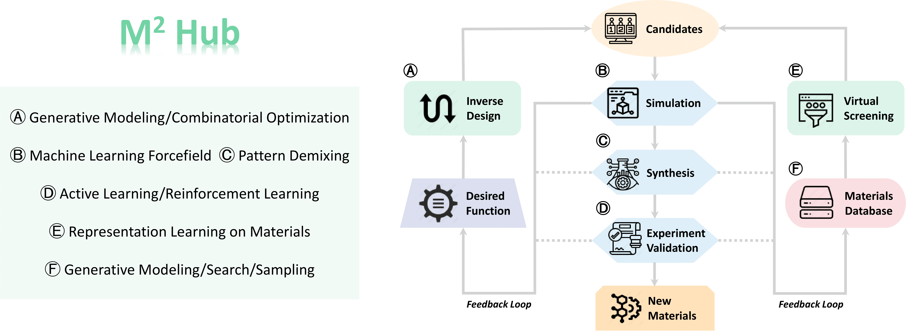

# M2Hub: Unlocking the Potential of Machine Learning for Materials Discovery

### [Paper on arXiv](https://arxiv.org/abs/2307.05378)



## What is M2Hub?
M2Hub aims to build the machine learning foundations for materials discovery which has a standard workflow from virtual screening/inverse design to simulation to experiment. M2Hub provides **data downloading**, **data processing**, 
(baseline and state-of-the-art) **machine learning method implementation**, **evaluation pipeline** and **benchmark results**.

<p align="center"></p>

## Why should I use M2Hub?
**For machine learning researchers**: M2Hub provides **dataset collection**, **problem formulation** and **machine learning workflow** to plug in *any newly developed model* for *benchmarking results*.

**For materials scientists**: M2Hub implements the **entire machine learning workflow** for plugging in *any materials datasets* to use. 

## How to use M2Hub?
M2Hub provides several key functions, data downloading, data processing, training machine learning models and benchmarking results.

### Environment Setup

```
conda env create -f environment.yml
```

### M2Hub Data Downloader

```
python download_data.py --task TASK --property PROPERTY --split SPLIT --get-edges
```

Please check [DATASETS.md](DATASETS.md) for details, splits include [random|composition|system|time].

For more details about each dataset, please check [DOCUMENTS.md](DOCUMENTS.md).

### Model Training

```
python -u main.py --mode train --config-yml configs/matbench/e_form/random/cgcnn.yml
```

Please check [MODELS.md](./MODELS.md) for details.

### Materials Generation

To facilitate the development of generative materials design, we provide oracle functions and evaluation metrics for generative modeling on materials.

**Oracle functions**

```
python run.py --Task steels --Data test_data.cif --Oracle rf_scm_magpie
```

We provide two oracle functions here, please use "--Oracle" to set which one you would like to use. Also, the running task can be set with "--Task". Please see our paper for more details.

**Evaluation Metrics**

```
python compute_metrics.py --root_path my_data --eval_model_name my_model --tasks recon gen opt
```

We provide evaluation metrics for reconstruction, generation, and optimizatioin tasks. Please check our paper for more details. The to-be-evaluated dataset should be under "--root_path" with a format like "eval_recon.pt". The folder containing the pre-trained property prediction model checkpoint should be under "./prop_models".

## M2Hub Leaderboards

We provide an initial benchmarking results over 13 tasks covering representative methods developed in the past. We will continue to incorporate new methods and welcome contributions from the community.

## How to get involved?

We welcome contributions in any format, from new datasets, materials discovery tasks, to machine learning models, evaluation methods, and benchmark results.

## Contact

Reach us at [yd392@cornell.edu](mailto:yd392@cornell.edu) and [yw2349@cornell.edu](mailto:yw2349@cornell.edu) or open a GitHub issue.

## License

M2Hub is released under the [MIT license](./LICENSE.md).

## Citing M2Hub

If you use our code in your work, please consider citing:

```bibtex
@article{du2023m,
  title={M $\^{} 2$ Hub: Unlocking the Potential of Machine Learning for Materials Discovery},
  author={Du, Yuanqi and Wang, Yingheng and Huang, Yining and Li, Jianan Canal and Zhu, Yanqiao and Xie, Tian and Duan, Chenru and Gregoire, John M and Gomes, Carla P},
  journal={arXiv preprint arXiv:2307.05378},
  year={2023}
}
```

## Acknowledgement

Open Catalyst Project ([https://github.com/Open-Catalyst-Project/ocp](https://github.com/Open-Catalyst-Project/ocp))

Crystal Diffusion Variational Autoencoder (CDVAE) ([https://github.com/txie-93/cdvae](https://github.com/txie-93/cdvae))


